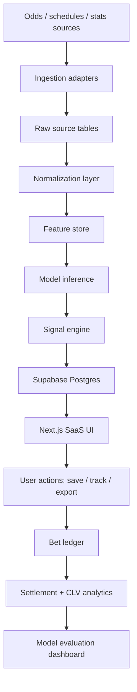

# Doctore AI — Technical Handoff for Developer Agent

**Version:** 0.3  
**Generated:** 2026-05-06  
**Owner:** Jami / Selfmade Capital  
**Purpose:** One-file technical handoff for an AI/software developer agent to continue implementation without reinterpreting the product from scratch.

---

## 0. Source status and constraints

This handoff consolidates the available project context and the uploaded betting-history CSV.

### Available source material

| Source | Status | How it was used |
|---|---:|---|
| `VEDONLYÖNTI SEURANTA - Vetohistoria.csv` | Readable | Parsed and summarized. Used to define ledger import requirements, validation rules and MVP analytics. |
| `Doctore AI - Product Requirements Document (PRD).gdoc` | Pointer only | The uploaded `.gdoc` file contains only a Google Docs pointer and document ID, not the PRD content. Content could not be read from the file itself in this environment. |
| `Doctore AI - Agent Skill Profiles.gdoc` | Pointer only | Same limitation as above. Agent-role structure below is reconstructed from the available Doctore AI project context and should be reconciled against the real Google Doc. |
| Prior project context from this working session | Available | Used for product summary, stack assumptions, betting-model direction and project constraints. |

### Critical caveat

The Google Docs were **not fully readable as document bodies**. A developer agent should treat this handoff as the current implementation baseline, then compare it against the real PRD and Agent Skill Profiles once Google Drive access or exported `.md/.docx` versions are available.


---

## 0.1 Architecture decision record — Firebase → Supabase

**Decision:** Supabase Postgres is the canonical persistence, authentication and authorization layer for Doctore AI. Firebase must be removed from the application stack.

### Context

The existing repository may contain Firebase-oriented code. That code path is now deprecated. The product domain is relational and audit-heavy: bets, signals, odds snapshots, CLV records, model runs, imports, settlements and user-owned analytics require joins, constraints, indexes, transactions and row-level security. A document database creates avoidable complexity for this product.

### Rationale

| Requirement | Firebase fit | Supabase/Postgres fit |
|---|---:|---:|
| Bet ledger with settlements and CLV joins | Weak | Strong |
| Reproducible signal audit trail | Medium | Strong |
| Relational odds/model/signal structure | Weak | Strong |
| SQL analytics by sport, market, model version and user | Weak | Strong |
| Row-level security for SaaS data isolation | Medium | Strong |
| CSV import validation and deduplication | Medium | Strong |
| Future ML feature-store compatibility | Weak/Medium | Strong |

### Consequence

All Firebase assumptions must be deleted or migrated. Do not maintain dual persistence paths.

### Migration rule

From this point forward:

1. **Do not add new Firebase code.**
2. **Do not keep Firebase as a fallback.**
3. **Do not store betting-domain data in Firestore.**
4. **Do not use Firebase Auth in parallel with Supabase Auth.**
5. **All user-owned rows must reference `auth.users(id)` and be protected by Supabase RLS.**
6. **All imports, model runs, predictions, signals, bets, settlements and CLV records must live in Postgres.**

### Required repository migration checklist

The Full Stack Developer Agent must perform this before building new features:

```bash
# 1. Find Firebase usage
rg -n "firebase|firestore|getFirestore|getAuth|initializeApp|firebase-admin|onAuthStateChanged|collection\(|doc\(|setDoc|addDoc|getDocs|query\(" .

# 2. Inspect package dependencies
cat package.json | jq '.dependencies, .devDependencies'

# 3. Remove Firebase packages after replacement
npm uninstall firebase firebase-admin

# 4. Add Supabase packages if missing
npm install @supabase/supabase-js @supabase/ssr

# 5. Verify no Firebase references remain
rg -n "firebase|firestore|firebase-admin|getFirestore|getAuth|initializeApp" .
```

### Environment variable replacement

Remove Firebase client/server env vars and use Supabase-specific variables.

```env
NEXT_PUBLIC_SUPABASE_URL=
NEXT_PUBLIC_SUPABASE_ANON_KEY=
SUPABASE_SERVICE_ROLE_KEY=
SUPABASE_DB_URL=
```

Rules:

- `NEXT_PUBLIC_SUPABASE_ANON_KEY` is allowed in browser clients.
- `SUPABASE_SERVICE_ROLE_KEY` is server-only and must never be exposed to client components.
- Use Vercel environment variables for Preview/Production. Local development can run with `vercel env run -- next dev` when project envs are managed in Vercel.

### Firebase → Supabase mapping

| Old Firebase concept | New Supabase implementation |
|---|---|
| Firebase Auth user | Supabase Auth user in `auth.users` |
| Firestore `users/{uid}` | `profiles` table keyed by `id uuid references auth.users(id)` |
| Firestore `bets` collection | `bet_ledger` table |
| Firestore `signals` collection | `signals` table joined to `predictions` and `odds_snapshots` |
| Firestore `modelRuns` collection | `model_runs` table |
| Firestore import docs | `bet_import_batches` + `source_payloads` tables |
| Firestore security rules | Postgres RLS policies |
| Firebase Admin SDK | Supabase service-role server client only in route handlers/jobs |

### Acceptance criteria

- `package.json` contains no `firebase` or `firebase-admin` dependency.
- Repository search returns no active Firebase imports or Firestore calls.
- Supabase client helpers exist for browser, server component and route-handler contexts.
- All private dashboard routes use Supabase session checks.
- RLS is enabled for `profiles`, `bet_ledger`, `bet_import_batches` and other user-owned tables.
- Integration tests prove user A cannot read or mutate user B’s ledger rows.


---

## 1. Product summary

Doctore AI is an MLB-focused sports betting analytics SaaS. The product identifies statistically mispriced bookmaker odds and presents a transparent betting signal to the user.

The user should see:

1. **Signal** — e.g. `BET`, `LEAN`, `PASS`, `AVOID`.
2. **Model probability** — calibrated probability for the selected side/market.
3. **Market probability** — no-vig market-implied probability.
4. **Probability gap / edge** — model probability minus market probability.
5. **Expected value** — EV after odds conversion and no-vig normalization.
6. **Kelly-sized stake** — capped fractional Kelly recommendation.
7. **Decision drivers** — top feature contributions or rule-based diagnostics.
8. **Risk notes** — confidence, liquidity, lineup confirmation, weather sensitivity, model coverage limits.

Core positioning:

> No tipsters. No opinions. Only auditable, reproducible math.

---

## 2. Business objective

Build a lean, defensible analytics product that can move from private internal tool to paid SaaS.

### Commercial goals

| Goal | Requirement |
|---|---|
| Validate actual betting edge | Track ROI, CLV, hit rate, drawdown and market-specific performance. |
| Create trust | Show probability, gap, stake sizing and decision drivers instead of opaque picks. |
| Reduce manual work | Automate odds ingestion, bet ledger import, feature computation and result settlement. |
| Enable paid access | Implement user accounts, saved signals, plan gating and audit logs. |
| Keep scope tight | Start with MLB moneyline / runline / totals before expanding to other sports. |

### Non-goals for MVP

- No automated bet placement.
- No guaranteed-profit messaging.
- No uncontrolled multi-sport expansion before MLB pipeline is stable.
- No model recommendations without auditable source data and result tracking.
- No production reliance on hand-entered spreadsheets beyond initial migration/import.

---

## 3. Current empirical data snapshot

Source: uploaded `VEDONLYÖNTI SEURANTA - Vetohistoria.csv`.

### Ledger summary

| Metric | Value |
|---|---:|
| Total rows | 286 |
| Settled rows | 283 |
| Open/missing result rows | 3 |
| Date range | 2025-08-14 → 2025-09-05 |
| Total stake | 161,570 u |
| Net P/L | 49,526.4 u |
| ROI | 30.65% |
| Win rate, excluding push | 60.36% |
| Average stake | 570.9 u |
| Average odds | 2.26 |
| Median odds | 2.02 |

### Performance by sport

| sport | bets | stake_u | pnl_u | roi_pct | win_rate_pct | avg_odds |
| --- | --- | --- | --- | --- | --- | --- |
| Baseball | 196 | 116,050 | 26,153.9 | 22.54% | 58.55% | 2.12 |
| Jalkapallo | 64 | 32,920 | 16,310.5 | 49.55% | 64.06% | 2.65 |
| Tennis | 14 | 7,500 | 3,591.0 | 47.88% | 64.29% | 2.39 |
| Football | 1 | 1,000 | 2,200.0 | 220.00% | 100.00% | 3.22 |
| Amerikkalainen jalkapallo | 1 | 500 | 610.0 | 122.00% | 100.00% | 2.22 |
| E-Sports | 1 | 600 | 366.0 | 61.00% | 100.00% | 1.62 |
| Koripallo | 6 | 3,000 | 295.0 | 9.83% | 50.00% | 2.14 |

### Performance by market / bet type — top rows by P/L

| market | bets | stake_u | pnl_u | roi_pct | win_rate_pct | avg_odds |
| --- | --- | --- | --- | --- | --- | --- |
| ML | 111 | 64,535 | 23,214.2 | 35.97% | 62.39% | 2.18 |
| 1X2 | 40 | 20,920 | 9,687.5 | 46.31% | 60.00% | 2.58 |
| Totals | 20 | 15,605 | 6,153.0 | 39.43% | 65.00% | 1.92 |
| RL | 25 | 15,510 | 5,507.2 | 35.51% | 62.50% | 2.24 |
| Over 8.5 | 8 | 4,500 | 2,390.0 | 53.11% | 75.00% | 2.05 |
| Under 7.5 | 3 | 1,500 | 1,245.0 | 83.00% | 100.00% | 1.83 |
| X | 1 | 500 | 1,220.0 | 244.00% | 100.00% | 3.44 |
| Over 2.5 | 3 | 1,500 | 1,160.0 | 77.33% | 100.00% | 1.79 |
| #ERROR! | 3 | 1,500 | 1,155.0 | 77.00% | 100.00% | 1.77 |
| Over 9.5 | 4 | 2,000 | 1,005.0 | 50.25% | 75.00% | 1.99 |
| Totals O 7,5 | 1 | 1,000 | 990.0 | 99.00% | 100.00% | 1.99 |
| Under 2 | 2 | 1,000 | 835.0 | 83.50% | 100.00% | 2.33 |
| Over 11 | 1 | 500 | 772.5 | 154.50% | 100.00% | 2.55 |
| ML (2nd) | 1 | 500 | 632.0 | 126.40% | 100.00% | 2.26 |
| Under 2.5 | 3 | 1,500 | 540.0 | 36.00% | 66.67% | 1.99 |
| Under 5.5 | 1 | 500 | 525.0 | 105.00% | 100.00% | 2.05 |
| -10.5 | 1 | 500 | 510.0 | 102.00% | 100.00% | 1.93 |
| Under 11 | 1 | 500 | 480.0 | 96.00% | 100.00% | 1.96 |
| Under 12 | 1 | 500 | 475.0 | 95.00% | 100.00% | 1.95 |
| Over 4.5 | 1 | 500 | 455.0 | 91.00% | 100.00% | 1.91 |

### Open/missing result rows

| date | Laji | Ottelu | Kohde | Kerroin | Panos_u |
| --- | --- | --- | --- | --- | --- |
| 2025-09-02 | Jalkapallo | Arsenal | 1X2 | 2.00 | 1,000 |
| 2025-09-02 | Jalkapallo | Real Sociedad | Totals | 1.79 | 1,000 |
| 2025-09-05 | Jalkapallo | FC Lahti | 1X2 | 2.10 | 315 |

### Data-quality observations

1. Finnish number formatting must be normalized: `1 000,00` → `1000.00`.
2. Unicode minus must be normalized: `−500,00` → `-500.00`.
3. Column `Unnamed: 4` is empty and should not be part of the canonical schema.
4. `Kohde` includes dirty values like `#ERROR!`; import should preserve raw value but map invalid market types to `UNKNOWN`.
5. Three rows have missing result/P&L and should remain `OPEN` until settled.
6. The sample is short and hand-tracked. It is suitable for ledger import testing, not model proof.
7. The reported ROI is high. Treat it as a private historical ledger statistic until validated against closing-line value and larger sample.

---

## 4. Canonical technical stack

Use this as the default unless the live repository proves otherwise.

| Layer | Technology | Role |
|---|---|---|
| Frontend | Next.js 14 App Router | SaaS UI, dashboards, signal pages. |
| Language | TypeScript | App, API routes, shared types. |
| Styling | Tailwind CSS | UI implementation. |
| Database | Supabase Postgres | Auth, relational data, row-level security. |
| Auth | Supabase Auth | User login and role-based access. |
| Backend API | Next.js Route Handlers initially; FastAPI optional for ML service | API gateway and model/prediction endpoints. |
| ML pipeline | Python, pandas, scikit-learn, XGBoost | Feature engineering, backtesting, model training and inference. |
| Jobs | Vercel Cron or external worker | Odds refresh, result settlement, data imports. |
| Deployment | Vercel | Web app hosting. |
| CI | GitHub Actions | Type check, lint, tests, migrations. |
| Observability | Structured logs + Supabase audit tables initially | Trace predictions, imports and user actions. |

### Stack rule

Do not introduce extra services until a concrete bottleneck exists. The MVP should run with:

- Next.js
- Supabase Postgres/Auth
- Python training scripts
- one inference boundary, either server-side TypeScript wrapper or FastAPI microservice
- scheduled ingestion/settlement jobs

Firebase is explicitly out of scope. If Firebase exists in the current repository, it is legacy code to be removed, not a competing architecture option.

---

## 5. Target architecture



### Architectural principles

1. **Raw data is immutable.** Store source payloads and normalized records separately.
2. **Every signal is reproducible.** Persist model version, feature snapshot, odds snapshot and calculation outputs.
3. **No silent model changes.** Any model update requires a `model_runs` record and backtest summary.
4. **Ledger is separate from predictions.** A recommendation can exist without a placed bet.
5. **CSV imports are first-class.** Historical hand-tracked data is valuable, but must be normalized and validated before analytics.
6. **No hardcoded betting math in UI.** EV, no-vig and Kelly logic belong in shared domain functions with tests.

---

## 6. Core user stories

### Visitor / unauthenticated user

- As a visitor, I can understand the product promise without seeing private model details.
- As a visitor, I can see a limited example of a signal card.
- As a visitor, I can sign up for access.

### Authenticated user

- As a user, I can view current MLB signals ranked by edge and confidence.
- As a user, I can inspect each signal’s probability, odds, edge, EV and stake sizing.
- As a user, I can see why the model likes or rejects a bet.
- As a user, I can filter by sport, league, market, time, bookmaker and confidence.
- As a user, I can add a signal to my bet ledger.
- As a user, I can import historical bets from CSV.
- As a user, I can see ROI, CLV, hit rate and drawdown by sport/market/time period.

### Admin / operator

- As an admin, I can run imports and see failures.
- As an admin, I can view model version performance.
- As an admin, I can disable a market or source if data quality drops.
- As an admin, I can inspect every generated signal’s raw inputs.

---

## 7. Domain model

### Main entities

| Entity | Purpose |
|---|---|
| `sports` | Baseball, football, tennis, etc. MVP focus: baseball / MLB. |
| `leagues` | MLB, NPB, KBO, etc. |
| `teams` | Canonical team table with aliases. |
| `games` | Scheduled events. |
| `sportsbooks` | Bookmaker/source metadata. |
| `markets` | Moneyline, runline, totals, props. |
| `odds_snapshots` | Timestamped bookmaker odds. |
| `source_payloads` | Immutable raw API/scrape/import records. |
| `features` | Versioned model-ready feature rows per game/market/selection. |
| `model_runs` | Training/backtest/inference model metadata. |
| `predictions` | Model probability output. |
| `signals` | Betting recommendation after market comparison and filters. |
| `bet_ledger` | User-tracked or imported bets. |
| `settlements` | Final results and P/L. |
| `clv_records` | Closing-line value tracking. |
| `audit_events` | Admin/user/system traceability. |

---

## 8. Suggested Supabase schema

Use this as a first migration baseline. Adjust naming only if the repository already has a convention.

```sql
-- 001_core_domain.sql

create table if not exists sports (
  id uuid primary key default gen_random_uuid(),
  slug text unique not null,
  name text not null,
  created_at timestamptz not null default now()
);

create table if not exists leagues (
  id uuid primary key default gen_random_uuid(),
  sport_id uuid not null references sports(id),
  slug text unique not null,
  name text not null,
  country text,
  created_at timestamptz not null default now()
);

create table if not exists teams (
  id uuid primary key default gen_random_uuid(),
  league_id uuid references leagues(id),
  slug text not null,
  name text not null,
  aliases text[] not null default '{}',
  created_at timestamptz not null default now(),
  unique (league_id, slug)
);

create table if not exists games (
  id uuid primary key default gen_random_uuid(),
  league_id uuid not null references leagues(id),
  external_id text,
  starts_at timestamptz not null,
  home_team_id uuid references teams(id),
  away_team_id uuid references teams(id),
  venue text,
  status text not null default 'scheduled',
  created_at timestamptz not null default now(),
  updated_at timestamptz not null default now(),
  unique (league_id, external_id)
);

create table if not exists sportsbooks (
  id uuid primary key default gen_random_uuid(),
  slug text unique not null,
  name text not null,
  is_sharp boolean not null default false,
  created_at timestamptz not null default now()
);

create table if not exists markets (
  id uuid primary key default gen_random_uuid(),
  slug text unique not null,
  name text not null,
  sport_id uuid references sports(id),
  market_type text not null check (market_type in ('moneyline','spread','total','prop','unknown')),
  created_at timestamptz not null default now()
);

create table if not exists source_payloads (
  id uuid primary key default gen_random_uuid(),
  source_name text not null,
  source_type text not null check (source_type in ('api','csv','scrape','manual')),
  fetched_at timestamptz not null default now(),
  source_key text,
  payload jsonb not null,
  payload_hash text,
  created_at timestamptz not null default now(),
  unique (source_name, source_key, payload_hash)
);

create table if not exists odds_snapshots (
  id uuid primary key default gen_random_uuid(),
  game_id uuid references games(id),
  sportsbook_id uuid references sportsbooks(id),
  market_id uuid references markets(id),
  selection text not null,
  line numeric,
  decimal_odds numeric not null check (decimal_odds > 1),
  implied_probability numeric generated always as (1 / decimal_odds) stored,
  captured_at timestamptz not null,
  source_payload_id uuid references source_payloads(id),
  created_at timestamptz not null default now()
);

create table if not exists model_runs (
  id uuid primary key default gen_random_uuid(),
  model_name text not null,
  model_version text not null,
  training_window daterange,
  metrics jsonb not null default '{}'::jsonb,
  feature_version text,
  artifact_uri text,
  created_at timestamptz not null default now(),
  unique (model_name, model_version)
);

create table if not exists feature_snapshots (
  id uuid primary key default gen_random_uuid(),
  game_id uuid references games(id),
  market_id uuid references markets(id),
  selection text not null,
  feature_version text not null,
  features jsonb not null,
  computed_at timestamptz not null default now()
);

create table if not exists predictions (
  id uuid primary key default gen_random_uuid(),
  model_run_id uuid not null references model_runs(id),
  feature_snapshot_id uuid not null references feature_snapshots(id),
  probability numeric not null check (probability >= 0 and probability <= 1),
  confidence numeric check (confidence >= 0 and confidence <= 1),
  explainability jsonb not null default '{}'::jsonb,
  predicted_at timestamptz not null default now()
);

create table if not exists signals (
  id uuid primary key default gen_random_uuid(),
  prediction_id uuid not null references predictions(id),
  odds_snapshot_id uuid not null references odds_snapshots(id),
  signal text not null check (signal in ('BET','LEAN','PASS','AVOID')),
  model_probability numeric not null,
  market_probability numeric not null,
  no_vig_probability numeric,
  edge numeric not null,
  expected_value numeric not null,
  kelly_fraction numeric,
  recommended_stake_units numeric,
  risk_flags text[] not null default '{}',
  created_at timestamptz not null default now()
);
```

```sql
-- 002_bet_ledger.sql

create table if not exists bet_import_batches (
  id uuid primary key default gen_random_uuid(),
  user_id uuid references auth.users(id),
  filename text,
  row_count integer not null default 0,
  settled_count integer not null default 0,
  error_count integer not null default 0,
  metadata jsonb not null default '{}'::jsonb,
  created_at timestamptz not null default now()
);

create table if not exists bet_ledger (
  id uuid primary key default gen_random_uuid(),
  user_id uuid references auth.users(id),
  import_batch_id uuid references bet_import_batches(id),
  signal_id uuid references signals(id),
  placed_at timestamptz,
  event_date date,
  sport_raw text,
  league_raw text,
  matchup_raw text,
  selection_raw text,
  market_raw text,
  market_type text not null default 'unknown',
  decimal_odds numeric check (decimal_odds > 1),
  stake_units numeric not null check (stake_units >= 0),
  result text not null default 'OPEN' check (result in ('WIN','LOSS','PUSH','VOID','OPEN')),
  pnl_units numeric,
  raw_row jsonb not null default '{}'::jsonb,
  created_at timestamptz not null default now(),
  updated_at timestamptz not null default now()
);

create table if not exists clv_records (
  id uuid primary key default gen_random_uuid(),
  bet_ledger_id uuid not null references bet_ledger(id),
  opening_odds numeric,
  placed_odds numeric,
  closing_odds numeric,
  placed_implied_probability numeric,
  closing_implied_probability numeric,
  clv_probability_delta numeric,
  clv_odds_delta numeric,
  created_at timestamptz not null default now()
);

create index if not exists idx_bet_ledger_user_event_date on bet_ledger(user_id, event_date);
create index if not exists idx_bet_ledger_result on bet_ledger(result);
create index if not exists idx_bet_ledger_market_type on bet_ledger(market_type);
```

---

## 9. CSV import contract

### Expected input columns from current ledger

| Raw column | Canonical field | Required | Transformation |
|---|---|---:|---|
| `Päivämäärä` | `event_date` | Yes | Parse `DD.MM.YYYY`. |
| `Laji` | `sport_raw` | Yes | Trim. Map later to canonical sport. |
| `Ottelu` | `matchup_raw` / `selection_raw` | Yes | Current sheet often uses team/selection, not full matchup. Preserve raw. |
| `Kohde` | `market_raw` | Yes | Map `ML`, `RL`, `Totals`, `1X2`; unknown values allowed. |
| `Kerroin` | `decimal_odds` | Yes | Convert comma decimal to dot. |
| `Panos (u)` | `stake_units` | Yes | Convert NBSP thousands and comma decimals. |
| `Tulos` | `result` | No | `Voitto`→`WIN`, `Tappio`→`LOSS`, `Push`→`PUSH`, missing→`OPEN`. |
| `Voitto/Tappio (u)` | `pnl_units` | No | Convert Unicode minus and comma decimals. Missing allowed when `OPEN`. |

### TypeScript parser skeleton

```ts
export type RawBetRow = Record<string, string | number | null | undefined>;

export type CanonicalBetResult = 'WIN' | 'LOSS' | 'PUSH' | 'VOID' | 'OPEN';

export interface ImportedBetRow {
  eventDate: string; // YYYY-MM-DD
  sportRaw: string;
  matchupRaw: string;
  selectionRaw?: string;
  marketRaw: string;
  marketType: 'moneyline' | 'spread' | 'total' | 'prop' | 'unknown';
  decimalOdds: number;
  stakeUnits: number;
  result: CanonicalBetResult;
  pnlUnits: number | null;
  rawRow: RawBetRow;
}

export function parseFinnishDecimal(value: unknown): number | null {
  if (value === null || value === undefined) return null;

  const normalized = String(value)
    .trim()
    .replace(/ /g, '')
    .replace(/\s/g, '')
    .replace(/−/g, '-')
    .replace(',', '.')
    .replace(/[^0-9.-]/g, '');

  if (!normalized || normalized === '-' || normalized === '.') return null;

  const parsed = Number(normalized);
  return Number.isFinite(parsed) ? parsed : null;
}

export function mapResult(value: unknown): CanonicalBetResult {
  const v = String(value ?? '').trim().toLowerCase();
  if (v === 'voitto') return 'WIN';
  if (v === 'tappio') return 'LOSS';
  if (v === 'push') return 'PUSH';
  if (v === 'void') return 'VOID';
  return 'OPEN';
}

export function mapMarketType(value: unknown): ImportedBetRow['marketType'] {
  const v = String(value ?? '').trim().toLowerCase();
  if (['ml', 'moneyline'].includes(v)) return 'moneyline';
  if (['rl', 'runline', 'spread'].includes(v) || /^[-+]\d/.test(v)) return 'spread';
  if (v.includes('over') || v.includes('under') || v.includes('total')) return 'total';
  if (v.includes('hr')) return 'prop';
  return 'unknown';
}
```

### Import validation rules

1. Reject a row only when required numeric fields cannot be parsed.
2. Preserve the original raw row in `raw_row` even if normalized fields are dirty.
3. Missing result means `OPEN`, not failed import.
4. `WIN` must have positive `pnl_units`; `LOSS` must have negative `pnl_units`; `PUSH` must be zero. Flag mismatch.
5. `decimal_odds <= 1` is invalid.
6. Duplicate detection should use: user, event_date, sport_raw, matchup_raw, market_raw, odds, stake, result, pnl.

---

## 10. Betting math domain functions

Implement as pure functions with unit tests.

```ts
export function impliedProbability(decimalOdds: number): number {
  if (decimalOdds <= 1) throw new Error('Decimal odds must be greater than 1');
  return 1 / decimalOdds;
}

export function removeVigTwoWay(priceA: number, priceB: number) {
  const pA = impliedProbability(priceA);
  const pB = impliedProbability(priceB);
  const overround = pA + pB;

  return {
    sideA: pA / overround,
    sideB: pB / overround,
    overround,
    margin: overround - 1,
  };
}

export function expectedValue(modelProbability: number, decimalOdds: number): number {
  if (modelProbability < 0 || modelProbability > 1) throw new Error('Invalid probability');
  return modelProbability * (decimalOdds - 1) - (1 - modelProbability);
}

export function kellyFraction(modelProbability: number, decimalOdds: number): number {
  const b = decimalOdds - 1;
  const q = 1 - modelProbability;
  const fraction = (b * modelProbability - q) / b;
  return Math.max(0, fraction);
}

export function cappedFractionalKelly(params: {
  modelProbability: number;
  decimalOdds: number;
  fraction?: number;
  maxStakeFraction?: number;
}): number {
  const rawKelly = kellyFraction(params.modelProbability, params.decimalOdds);
  const fractional = rawKelly * (params.fraction ?? 0.25);
  return Math.min(fractional, params.maxStakeFraction ?? 0.02);
}
```

Required tests:

- odds conversion correctness
- no-vig probabilities sum to 1
- negative EV returns zero Kelly stake
- capped Kelly never exceeds configured cap
- invalid odds/probabilities throw

---

## 11. Signal engine specification

### Inputs

| Input | Description |
|---|---|
| `model_probability` | Calibrated model probability for the selection. |
| `decimal_odds` | Best currently available decimal odds. |
| `market_probability` | Raw implied probability. |
| `no_vig_probability` | Market probability after margin removal where possible. |
| `confidence` | Model confidence or calibration confidence. |
| `liquidity_score` | Optional market quality score. |
| `risk_flags` | Missing lineup, weather uncertainty, stale odds, low sample, etc. |

### Output rule baseline

```ts
export function classifySignal(input: {
  modelProbability: number;
  noVigProbability: number;
  decimalOdds: number;
  confidence: number;
  riskFlags: string[];
}): 'BET' | 'LEAN' | 'PASS' | 'AVOID' {
  const edge = input.modelProbability - input.noVigProbability;
  const ev = expectedValue(input.modelProbability, input.decimalOdds);

  if (input.riskFlags.includes('STALE_ODDS')) return 'AVOID';
  if (input.confidence < 0.55) return 'PASS';
  if (edge >= 0.035 && ev >= 0.03) return 'BET';
  if (edge >= 0.015 && ev > 0) return 'LEAN';
  if (ev < -0.02) return 'AVOID';
  return 'PASS';
}
```

Thresholds must be configurable and versioned. Do not bury business rules inside UI components.

---

## 12. ML and feature-engineering pipeline

### MVP model boundary

Start with a reproducible offline pipeline and deterministic inference endpoint.

1. `scripts/ingest_*` pulls or imports source data.
2. `scripts/build_features.py` creates model-ready rows.
3. `scripts/train_model.py` trains and evaluates.
4. `scripts/backtest.py` runs chronological walk-forward validation.
5. `api/predict` or `services/ml/predict.py` returns probability + explanation.
6. Signal engine compares prediction to market odds.

### Minimum feature groups for MLB

| Group | Examples |
|---|---|
| Team strength | rolling win rate, run differential, Elo, home/away splits. |
| Starting pitcher | ERA, FIP/xFIP proxy, recent form, handedness, rest days. |
| Bullpen | rolling bullpen ERA/FIP proxy, workload last 3 days. |
| Batting | wRC+ proxy, OPS, strikeout/walk rate, handedness splits. |
| Market | opening line, current line, line movement, sharp-vs-soft spread. |
| Weather/park | temperature, wind, park factor, roof flag. |
| Schedule | travel, rest, doubleheader, time-zone shift. |
| Lineups | confirmed lineup availability, missing key bats. |

### Model-performance gates

A model version is not deployable unless the following are stored in `model_runs.metrics`:

- AUC-ROC
- Brier score
- log loss
- calibration slope/intercept or calibration-bin table
- chronological backtest ROI
- CLV performance
- number of games and number of bet recommendations
- max drawdown
- market-specific performance

### Backtesting rules

1. Use chronological split only. No random split for deployability decisions.
2. Never train on odds/results that would not have been known at prediction time.
3. Persist the exact odds snapshot used for each simulated recommendation.
4. Separate model accuracy from betting profitability.
5. Compare against no-bet baseline and closing line.
6. Report sample size before ROI.

---

## 13. API surface

### Public/internal route design

| Route | Method | Purpose |
|---|---:|---|
| `/api/signals` | GET | Current ranked signals. |
| `/api/signals/:id` | GET | Full signal detail with drivers and source trace. |
| `/api/ledger/import` | POST | CSV upload/import. |
| `/api/ledger` | GET | User ledger rows. |
| `/api/ledger/:id` | PATCH | Update result/odds/stake. |
| `/api/analytics/ledger` | GET | ROI, P/L, win rate, drawdown, CLV. |
| `/api/admin/imports` | GET | Import batch status. |
| `/api/admin/jobs/refresh-odds` | POST | Manual odds refresh. |
| `/api/admin/model-runs` | GET | Model version registry. |

### `/api/signals` response contract

```ts
export interface SignalListItem {
  id: string;
  startsAt: string;
  league: string;
  market: string;
  selection: string;
  sportsbook: string;
  decimalOdds: number;
  signal: 'BET' | 'LEAN' | 'PASS' | 'AVOID';
  modelProbability: number;
  noVigProbability: number | null;
  edge: number;
  expectedValue: number;
  recommendedStakeUnits: number | null;
  confidence: number | null;
  riskFlags: string[];
  modelVersion: string;
}
```

### `/api/analytics/ledger` response contract

```ts
export interface LedgerAnalyticsResponse {
  filters: {
    from?: string;
    to?: string;
    sport?: string;
    marketType?: string;
  };
  summary: {
    bets: number;
    settledBets: number;
    stakeUnits: number;
    pnlUnits: number;
    roi: number;
    winRate: number;
    avgOdds: number;
    avgStake: number;
    maxDrawdownUnits: number;
  };
  breakdowns: {
    bySport: LedgerBreakdownRow[];
    byMarket: LedgerBreakdownRow[];
    byDate: LedgerBreakdownRow[];
  };
}

export interface LedgerBreakdownRow {
  key: string;
  bets: number;
  stakeUnits: number;
  pnlUnits: number;
  roi: number;
  winRate: number;
}
```

---

## 14. Frontend screens

### MVP navigation

1. Dashboard
2. Signals
3. Signal detail
4. Bet ledger
5. Import history
6. Analytics
7. Admin/model runs

### Signal card requirements

Each signal card must show:

- game / teams / start time
- market and selection
- best odds and bookmaker
- model probability
- no-vig market probability
- edge
- EV
- recommended stake
- confidence
- top 3 drivers
- risk flags
- model version

### Ledger dashboard requirements

Minimum widgets:

- net P/L
- ROI
- win rate
- total stake
- average odds
- average stake
- open bets
- P/L chart over time
- table by sport
- table by market
- raw ledger table with filters

---

## 15. Agent skill profile reconstruction

Because the uploaded Agent Skill Profiles Google Doc is not readable here, use this reconstructed role split until the original is available.

### 15.1 Full Stack Developer Agent

**Mission:** Implement product features end-to-end in small, testable PRs.

Responsibilities:

- inspect repository before changing architecture
- implement Supabase migrations
- build typed API routes
- implement server actions or route handlers
- create UI screens with loading/error states
- write unit/integration tests
- keep domain math outside UI
- maintain type safety across DB/API/UI

Deliverables:

- migration files
- typed domain functions
- API endpoints
- React components
- tests
- PR summary with verification steps

### 15.2 Data Engineer Agent

**Mission:** Make source data reliable and model-ready.

Responsibilities:

- build CSV import pipeline
- create source adapter interface
- persist immutable raw payloads
- normalize teams/markets/books
- validate row-level quality
- produce feature tables
- document data lineage

Deliverables:

- import scripts
- parsers
- validation reports
- feature builder
- data dictionary

### 15.3 ML Engineer Agent

**Mission:** Produce reproducible predictions and backtests.

Responsibilities:

- define training dataset
- prevent leakage
- implement chronological split
- train baseline model
- calibrate probabilities
- explain feature drivers
- persist model artifacts and metrics

Deliverables:

- training scripts
- backtest reports
- model registry records
- inference function/API
- calibration outputs

### 15.4 QA / Review Agent

**Mission:** Catch defects before merge.

Responsibilities:

- verify betting math
- test CSV edge cases
- test RLS and auth boundaries
- test loading/error/empty states
- review type safety
- review security risks

Deliverables:

- review comments
- failing tests where relevant
- acceptance checklist

### 15.5 Product / Strategy Agent

**Mission:** Protect scope, business value and monetization path.

Responsibilities:

- prioritize high-ROI implementation tasks
- maintain PRD alignment
- prevent overengineering
- define acceptance criteria
- translate user feedback to backlog

Deliverables:

- prioritized roadmap
- feature specs
- acceptance criteria
- pricing/access recommendations

---

## 16. Repository structure target

```txt
doctor-ai/
  app/
    (marketing)/
    (dashboard)/
      dashboard/
      signals/
      ledger/
      analytics/
      admin/
    api/
      signals/
      ledger/
      analytics/
      admin/
  components/
    ui/
    signals/
    ledger/
    analytics/
  lib/
    betting/
      odds.ts
      ev.ts
      kelly.ts
      signal-engine.ts
    csv/
      parse-ledger.ts
    db/
      supabase-client.ts
      types.ts
    validation/
  scripts/
    import_ledger_csv.py
    build_features.py
    train_model.py
    backtest.py
  supabase/
    migrations/
    seed.sql
  tests/
    unit/
    integration/
  docs/
    architecture.md
    conventions.md
    data-dictionary.md
    model-card.md
    technical-handoff.md
```


---

## 16.1 Supabase integration standard

Use one typed Supabase integration layer. Do not instantiate ad-hoc clients across components.

### Required files

```txt
lib/db/
  supabase-browser.ts
  supabase-server.ts
  supabase-admin.ts
  database.types.ts
middleware.ts
```

### Browser client

```ts
// lib/db/supabase-browser.ts
import { createBrowserClient } from '@supabase/ssr';
import type { Database } from './database.types';

export function createClient() {
  return createBrowserClient<Database>(
    process.env.NEXT_PUBLIC_SUPABASE_URL!,
    process.env.NEXT_PUBLIC_SUPABASE_ANON_KEY!,
  );
}
```

### Server client

```ts
// lib/db/supabase-server.ts
import { cookies } from 'next/headers';
import { createServerClient } from '@supabase/ssr';
import type { Database } from './database.types';

export async function createClient() {
  const cookieStore = await cookies();

  return createServerClient<Database>(
    process.env.NEXT_PUBLIC_SUPABASE_URL!,
    process.env.NEXT_PUBLIC_SUPABASE_ANON_KEY!,
    {
      cookies: {
        getAll() {
          return cookieStore.getAll();
        },
        setAll(cookiesToSet) {
          cookiesToSet.forEach(({ name, value, options }) => {
            cookieStore.set(name, value, options);
          });
        },
      },
    },
  );
}
```

### Admin client

```ts
// lib/db/supabase-admin.ts
import { createClient } from '@supabase/supabase-js';
import type { Database } from './database.types';

export function createAdminClient() {
  const url = process.env.NEXT_PUBLIC_SUPABASE_URL;
  const serviceRoleKey = process.env.SUPABASE_SERVICE_ROLE_KEY;

  if (!url || !serviceRoleKey) {
    throw new Error('Missing Supabase admin environment variables');
  }

  return createClient<Database>(url, serviceRoleKey, {
    auth: {
      persistSession: false,
      autoRefreshToken: false,
    },
  });
}
```

### RLS baseline

```sql
alter table bet_import_batches enable row level security;
alter table bet_ledger enable row level security;

create policy "Users can read own import batches"
on bet_import_batches for select
to authenticated
using (user_id = auth.uid());

create policy "Users can insert own import batches"
on bet_import_batches for insert
to authenticated
with check (user_id = auth.uid());

create policy "Users can read own bets"
on bet_ledger for select
to authenticated
using (user_id = auth.uid());

create policy "Users can insert own bets"
on bet_ledger for insert
to authenticated
with check (user_id = auth.uid());

create policy "Users can update own bets"
on bet_ledger for update
to authenticated
using (user_id = auth.uid())
with check (user_id = auth.uid());
```

### Developer-agent sequencing

1. Remove Firebase imports, config files and dependencies.
2. Add Supabase env vars and typed clients.
3. Add migrations before UI rewrites.
4. Generate `database.types.ts` from Supabase schema.
5. Replace auth/session checks.
6. Replace Firestore reads/writes with typed Supabase queries.
7. Add RLS tests and route-handler integration tests.


---

## 17. Implementation backlog

### Phase 1 — Stabilize foundation

| Priority | Task | Acceptance criteria |
|---:|---|---|
| P0 | Create `docs/technical-handoff.md` | This document is committed and linked from `README.md`. |
| P0 | Remove Firebase and standardize on Supabase | No Firebase packages, config files, imports or Firestore calls remain; Supabase clients/env vars are in place. |
| P0 | Add Supabase migrations for core domain + ledger | Migrations run locally; tables exist; indexes created. |
| P0 | Add betting math functions | Unit tests cover implied probability, no-vig, EV, Kelly. |
| P0 | Add CSV parser for Finnish ledger format | Current uploaded CSV imports without crashing; dirty rows are flagged. |
| P0 | Add ledger analytics API | Returns summary + breakdowns matching CSV-derived metrics. |
| P1 | Add dashboard UI for ledger analytics | User sees ROI, P/L, win rate and breakdown tables. |
| P1 | Add import batch UI | User sees import success/failure counts. |

### Phase 2 — Signals MVP

| Priority | Task | Acceptance criteria |
|---:|---|---|
| P0 | Create odds snapshot schema and seed data | Can store bookmaker/market/selection odds. |
| P0 | Implement signal engine | Given prediction + odds, returns `BET/LEAN/PASS/AVOID`. |
| P0 | Build signal list UI | Signals can be ranked by edge/EV/confidence. |
| P1 | Add signal detail page | Shows drivers, flags, model version and raw source trace. |
| P1 | Add ledger action from signal | User can save signal to ledger. |

### Phase 3 — ML pipeline

| Priority | Task | Acceptance criteria |
|---:|---|---|
| P0 | Define feature schema | Feature snapshot persisted as JSON with version. |
| P0 | Implement baseline model training | Produces metrics and artifact. |
| P0 | Implement chronological backtest | Stores sample size, ROI, CLV proxy, drawdown. |
| P1 | Add calibration report | Brier/log loss/calibration bins visible in model card. |
| P1 | Add model registry UI | Admin can inspect model runs. |

### Phase 4 — SaaS hardening

| Priority | Task | Acceptance criteria |
|---:|---|---|
| P0 | Add RLS policies | Users can only see their ledger rows. Admin access explicitly controlled. |
| P0 | Add auth-gated dashboard routes | Anonymous users cannot access private data. |
| P1 | Add plan/access gating | Free/paid/admin roles supported. |
| P1 | Add audit logging | Imports, model runs and admin jobs are traceable. |
| P2 | Add export | User can export ledger analytics to CSV. |

---

## 18. Security, compliance and risk controls

### Product risk

Sports betting analytics must avoid misleading certainty.

Required UI language:

- Show probabilities and uncertainty.
- Show sample sizes.
- Show historical performance with date ranges.
- Never state or imply guaranteed profit.
- Separate model recommendation from actual betting outcome.

### Technical security

- Enable Supabase RLS on user-owned tables.
- Never expose service-role keys to the browser.
- Validate all CSV uploads server-side.
- Limit CSV file size.
- Store raw imports but sanitize display output.
- Use admin-only routes for ingestion/model operations.
- Log model version and source snapshot for every signal.

### Data leakage controls

- Avoid training on closing odds if prediction is intended for pre-game odds.
- Avoid using final lineups unless timestamp confirms they were available.
- Avoid using post-game stats in pre-game features.
- Maintain feature timestamp discipline.

---

## 19. Definition of done

A feature is done only when:

1. Types compile.
2. Tests pass.
3. Database migrations are reversible or safe to re-run.
4. API contracts are typed.
5. Empty/loading/error UI states exist.
6. Auth/RLS behavior is verified where applicable.
7. Betting math is covered by tests.
8. Any generated signal can be traced back to odds, model version and features.
9. Documentation is updated.

---

## 20. Immediate developer-agent prompt

Use the following as the next prompt to a coding agent:

```md
You are the Full Stack Developer Agent for Doctore AI.

Primary objective: migrate the project from Firebase to Supabase, then implement the MVP foundation for ledger import + betting analytics + signal engine without overengineering.

Start by inspecting the repository. Do not assume files exist. Treat any Firebase implementation as legacy code to be removed, not as an alternative architecture. Then implement in small commits/PR-sized changes:

1. Add `docs/technical-handoff.md` using the provided handoff content.
2. Inventory Firebase usage with `rg` and remove Firebase dependencies, config files, imports and Firestore/Auth calls.
3. Add Supabase environment variables, typed clients and auth/session helpers.
4. Add Supabase migrations for core domain and bet ledger tables.
5. Add RLS policies for user-owned tables and tests proving user-level data isolation.
6. Add pure betting math utilities:
   - implied probability
   - two-way no-vig
   - expected value
   - Kelly fraction
   - capped fractional Kelly
7. Add unit tests for all betting math functions.
8. Add CSV ledger parser for the Finnish spreadsheet format:
   - comma decimals
   - NBSP thousands
   - Unicode minus
   - Finnish result labels
   - missing result = OPEN
9. Add ledger analytics summarizer:
   - bets
   - stake
   - P/L
   - ROI
   - win rate excluding pushes
   - average odds
   - average stake
   - breakdown by sport and market
10. Add minimal dashboard UI or API response for these analytics, depending on current repo state.

Constraints:
- Keep domain math outside UI components.
- Preserve raw imported rows.
- Do not add automated betting.
- Do not introduce new infrastructure unless the repo already has it.
- Do not keep Firebase as fallback or parallel persistence.
- Any assumptions must be documented in the PR summary.

Verification:
- `npm run typecheck`
- `npm run lint`
- `npm test`
- Supabase migration check
- RLS isolation test
- Parser test using a fixture equivalent to the uploaded CSV format
- `rg -n "firebase|firestore|firebase-admin|getFirestore|getAuth|initializeApp" .` returns no active application code references
```

---

## 21. Open decisions

| Decision | Current recommendation | Why |
|---|---|---|
| Inference boundary | Start inside app/service layer; split to FastAPI only when needed. | Fewer moving parts for MVP. |
| First market | MLB moneyline, then runline/totals. | Limits feature/data complexity. |
| Ledger units | Keep `stake_units` and `pnl_units`; do not assume EUR. | Current CSV uses units. |
| CSV import handling | Soft-fail dirty rows, preserve raw data. | Avoid losing historical data. |
| Model release gate | Require calibration + chronological backtest + CLV tracking. | ROI alone is not enough. |
| Agent workflow | One agent per vertical; Full Stack agent owns integration. | Reduces context collision. |

---

## 22. Reconciliation checklist when real PRD/docs are available

Once the actual Google Docs are exported or connected, compare and update:

- exact product scope
- pricing/access model
- full agent skill definitions
- final tech stack versions
- data source policy
- UI route names
- model metrics and backtest claims
- compliance wording
- launch roadmap

Do not treat this handoff as final contractual PRD until that reconciliation is done.
